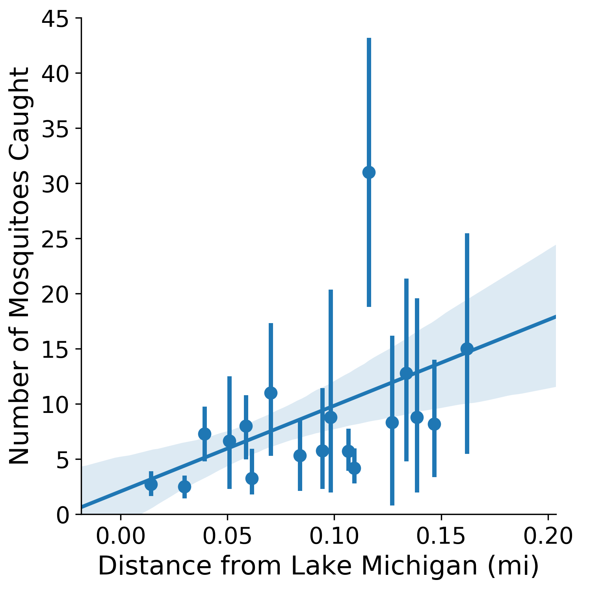
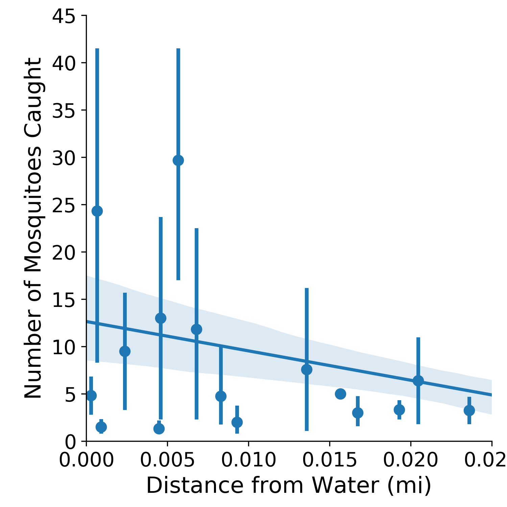
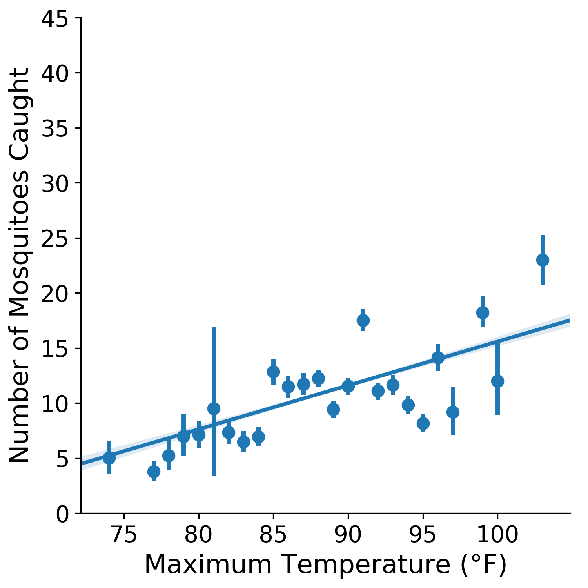
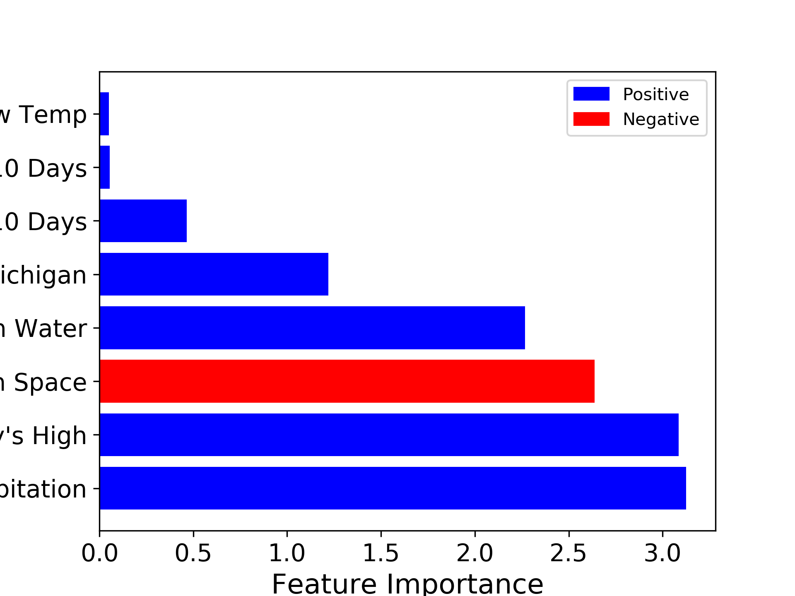

# MosquitoKnow!
## Predicting mosquito activity in Chicago.
Mosquitoes are more than just annoying. Mosquito-borne illnesses affect many Americans, and the state of Illinois is particularly hard-hit. Last year, the state had over 10% of the country’s west nile virus cases. To keep these outbreaks at bay, the city of Chicago spends nearly $2M annually on mosquito control including chemical spraying, which is toxic. The question is: Can we make this more efficient? Mosquitoes enjoy standing water and warm air temperatures, and usually reach maturity in 8-10 days.

The solution is to forecast mosquito activity based on weather and geographic features.
The data available includes:
 * Counts of mosquito traps set around the city
 * Geospatial data including the locations of waterways and parks
 * Weather data from one life cycle leading up to a trap observation, including temperatures and precipitation.

In looking at the data, there are nontrivial relationships between the number of mosquitoes observed, and certain weather and geospatial features.
Here, Lake Michigan is separated from other bodies of water since it has its own effect on the local climate.

A linear regression model was implemented.
While many features proved important, it was found that certain features weren’t, such as amount of precipitation.

